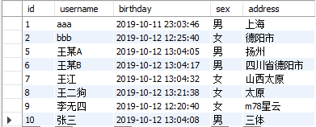
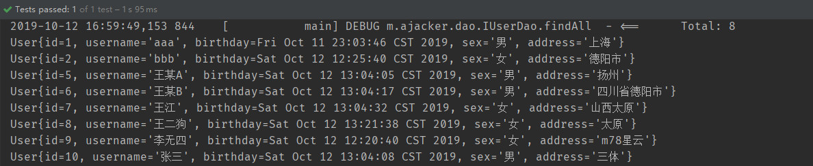
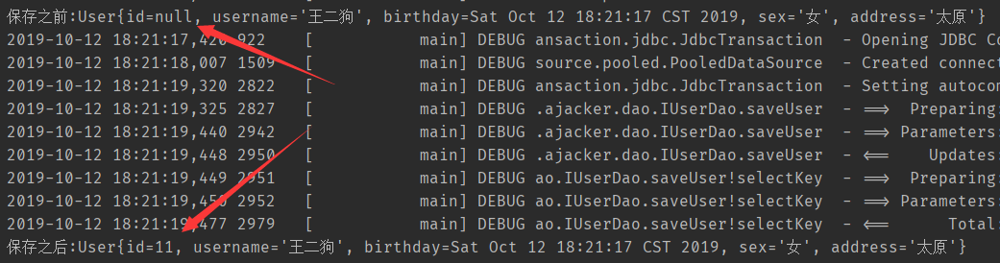
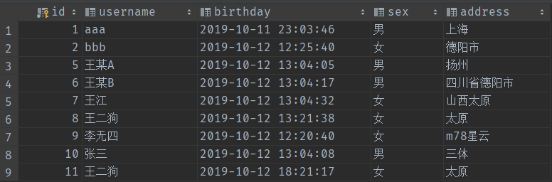
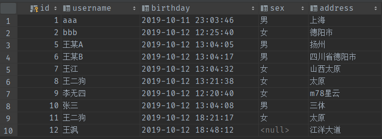
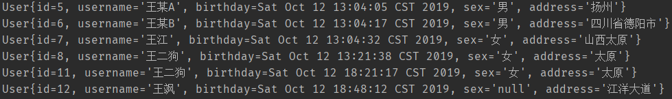
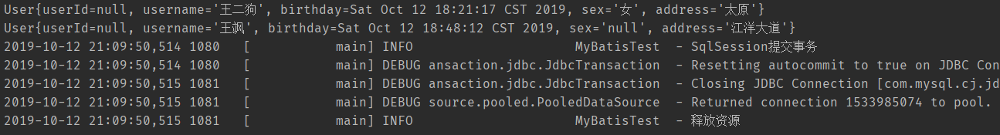

## 1、简介

### 1.1、什么是Mybatis

- MyBatis 是一款优秀的**持久层框架**
- 支持**定制化 SQL、存储过程以及高级映射**
- MyBatis **避免了几乎所有的 JDBC 代码和手动设置参数以及获取结果集**。MyBatis 可以**使用简单的 XML 或注解来配置和映射原生类型、接口和 Java 的 POJO**（Plain Old Java Objects，普通老式 Java 对象）为数据库中的记录。 

如何使用Mybatis？

- Maven依赖导入：

  ```xml
  <dependency>
       <groupId>org.mybatis</groupId>
       <artifactId>mybatis</artifactId>
       <version>3.5.2</version>
  </dependency>
  ```

- 中文官方文档： https://mybatis.org/mybatis-3/zh/index.html 

什么是框架？

> 框架（Framework）是整个或部分系统的可重用设计，表现为一组抽象构件及构件实例间交互的方法;另一种 定义认为，框架是可被应用开发者定制的应用骨架。前者是从应用方面而后者是从目的方面给出的定义。  

### 1.2、持久化

数据持久化

- 持久化就是将数据在持久状态和瞬时状态转换的过程
- 内存：**断电丢失**
- 数据库（Jdbc）、io文件持久化
- 就是将容易丢失的数据保存到本地或者数据库中

**为什么需要持久化？**

- 内存中文件容易丢失，不利于长久保存
- 保存重要数据

### 1.3、三层架构

- **表现层：**是用于展示数据的
- **业务层：**是处理业务需求
- **持久层：**是和数据库交互的 

### 1.4、持久层

- 完成持久化工作
- 层与层之间界限明显，协同工作

**持久层技术的解决方案**

- JDBC技术：
  - Connection
  - PreparedStatement
  - ResultSet 
-  Spring的`JdbcTemplate` ： Spring中对jdbc的简单封装 
-  Apache的`DBUtils`： 对Jdbc的简单封装  

### 1.5、为什么需要Mybatis

- 简化jdbc代码的使用
- 帮助程序使用数据库
- 方便数据库方面的操作
- 优点：
-  使开发者只需要关注sql语句本身，而无需关注注册驱动，创建连接等繁杂过程。 
  - sql和代码分离，易于维护
  - 提供映射标签，支持对象和数据库字段关系映射
  - 提供xml标签，支持动态sql
  - 提供对象关系映射标签，支持对象关系组件维护

### 1.6、ORM是什么

**ORM：**

> Object Relational Mappging 对象关系映射
> 简单的说：就是把数据库表和实体类及实体类的属性对应起来，让我们可以操作实体类就实现操作数据库表。 

## 2、入门案例(day01_01mybatis)

### 2.1、创建表和插入数据



### 2.2、导入maven依赖

```xml
<?xml version="1.0" encoding="UTF-8"?>
<project xmlns="http://maven.apache.org/POM/4.0.0"
         xmlns:xsi="http://www.w3.org/2001/XMLSchema-instance"
         xsi:schemaLocation="http://maven.apache.org/POM/4.0.0 http://maven.apache.org/xsd/maven-4.0.0.xsd">
    <modelVersion>4.0.0</modelVersion>

    <groupId>com.ajacker</groupId>
    <artifactId>MyBatisLearn</artifactId>
    <packaging>pom</packaging>
    <version>1.0-SNAPSHOT</version>
    <modules>
        <module>day01_01mybatis</module>
    </modules>
    <dependencies>
        <dependency>
            <groupId>org.mybatis</groupId>
            <artifactId>mybatis</artifactId>
            <version>3.5.2</version>
        </dependency>
        <dependency>
            <groupId>mysql</groupId>
            <artifactId>mysql-connector-java</artifactId>
            <version>8.0.15</version>
        </dependency>
        <dependency>
            <groupId>junit</groupId>
            <artifactId>junit</artifactId>
            <version>4.13-beta-3</version>
        </dependency>
        <dependency>
            <groupId>log4j</groupId>
            <artifactId>log4j</artifactId>
            <version>1.2.17</version>
        </dependency>
    </dependencies>
</project>
```

### 2.3、创建实体类和dao的接口

- `User.java`

  ```java
  package com.ajacker.domain;
  
  import java.io.Serializable;
  import java.util.Date;
  
  /**
   * @author ajacker
   */
  public class User implements Serializable {
      private Integer id;
      private String username;
      private Date birthday;
      private String sex;
      private String address;
  
      public Integer getId() {
          return id;
      }
  
      public void setId(Integer id) {
          this.id = id;
      }
  
      public String getUsername() {
          return username;
      }
  
      public void setUsername(String username) {
          this.username = username;
      }
  
      public Date getBirthday() {
          return birthday;
      }
  
      public void setBirthday(Date birthday) {
          this.birthday = birthday;
      }
  
      public String getSex() {
          return sex;
      }
  
      public void setSex(String sex) {
          this.sex = sex;
      }
  
      public String getAddress() {
          return address;
      }
  
      public void setAddress(String address) {
          this.address = address;
      }
  
      @Override
      public String toString() {
          return "User{" +
                  "id=" + id +
                  ", username='" + username + '\'' +
                  ", birthday=" + birthday +
                  ", sex='" + sex + '\'' +
                  ", address='" + address + '\'' +
                  '}';
      }
  }
  
  ```

- `IUserDao.java`

  ```java
  package com.ajacker.dao;
  
  import com.ajacker.domain.QueryVo;
  import com.ajacker.domain.User;
  
  import java.util.List;
  
  /**
   * @author ajacker
   * 用户的持久层接口
   */
  public interface IUserDao {
      /**
       * 查询所有
       * @return 查询结果 无为null
       */
      List<User> findAll();
  }
  ```

### 2.4、创建主要配置文件

在`resources`下创建配置文件

- ` SqlMapConifg.xml `（用于配置`mybatis`的相关设置）

  ```xml
  <?xml version="1.0" encoding="UTF-8" ?>
  <!DOCTYPE configuration
          PUBLIC "-//mybatis.org//DTD Config 3.0//EN"
          "http://mybatis.org/dtd/mybatis-3-config.dtd">
  <!--配置-->
  <configuration>
      <!--引入外部配置文件-->
      <properties resource="jdbcConfig.properties"/>
      <!--配置环境，环境可以配置多个，现在默认是mysql-->
      <environments default="mysql">
          <!--配置mysql环境-->
          <environment id="mysql">
              <!--事务管理器-->
              <transactionManager type="jdbc"/>
              <!--数据源-->
              <dataSource type="pooled">
                  <property name="driver" value="${jdbc.driver}"/>
                  <property name="url" value="${jdbc.url}"/>
                  <property name="username" value="${jdbc.username}"/>
                  <property name="password" value="${jdbc.password}"/>
              </dataSource>
          </environment>
      </environments>
      <!--映射器-->
      <mappers>
          <mapper resource="com/ajacker/dao/IUserDao.xml"/>
      </mappers>
  </configuration>
  ```

- `jdbcConfig.propertis`（` SqlMapConifg.xml `导入了此文件的设置）用于配置数据库信息

  ```properties
  jdbc.driver=com.mysql.cj.jdbc.Driver
  jdbc.url=jdbc:mysql://localhost:3306/spring?serverTimezone=Asia/Shanghai
  jdbc.username=root
  jdbc.password=123456
  ```

### 2.5、创建映射配置文件

` IUserDao.xml `创建在`resources`下的和对应类包路径相同的文件夹路径下(`com/ajacker/dao/IUserDao.xml`)

```xml
<?xml version="1.0" encoding="UTF-8" ?>
<!DOCTYPE mapper PUBLIC "-//mybatis.org//DTD Mapper 3.0//EN" "http://mybatis.org/dtd/mybatis-3-mapper.dtd" >
<mapper namespace="com.ajacker.dao.IUserDao">

    <!--配置查询所有-->
    <select id="findAll" resultType="com.ajacker.domain.User">
        select * from user
    </select>

</mapper>
```

- 注意事项：

  - mapper子标签的标签和查询类型对应，例如`<select>`、`<insert>`、`<delete>`
    - `id`：属性必须是方法名称
    - `resultType`：属性标明了返回值类型，是类型的**全限定类名或别名**

  - `namesapce`：是绑定的持久层接口的全限定类名

### 2.6、编写测试类

- 创建测试类`MybatisTest.java`

  ```java
  public class MyBatisTest {
      private InputStream in;
      private SqlSession sqlSession;
      private IUserDao userDao;
  
      @Before
      public void init() throws IOException {
          //1.读取配置文件
          in = Resources.getResourceAsStream("SqlMapConfig.xml");
          //2.创建SqlSessionFactory工厂
          SqlSessionFactoryBuilder builder = new SqlSessionFactoryBuilder();
          SqlSessionFactory factory = builder.build(in);
          //3.使用工厂生产SqlSession对象
          sqlSession = factory.openSession();
          //4.使用SqlSession创建Dao接口的代理对象
          userDao = sqlSession.getMapper(IUserDao.class);
      }
  
      @After
      public void destroy() throws IOException {
          //提交事务
          sqlSession.commit();
          //6.释放资源
          sqlSession.close();
          in.close();
      }
  
      /**
       * 测试查询所有
       */
      @Test
      public void testFindAll() throws Exception {
          //5.使用代理对象执行方法
          List<User> users = userDao.findAll();
          users.forEach(System.out::println);
      }
  }
  
  ```

  此时运行测试方法可以看见我们准备好的数据已经被全部查询出来了：

  

## 3、CURD

### 3.1、select

选择、查询语句

- `id`：属性必须是方法名称
- `resultType`：属性标明了返回值类型，是类型的**全限定类名或别名**

- `parameterType`：标明参数类型，是类型的**全限定类名或别名**

#### 3.1.1、查询所有

1. 编写接口：

   ```java
   /**
   * 查询所有
   * @return 查询结果
   */
   List<User> findAll();
   ```

2. 编写mapper中对应的sql语句：

   ```xml
   <!--配置查询所有-->
   <select id="findAll" resultType="com.ajacker.domain.User">
       select * from user
   </select>
   ```

3. 编写测试类测试：

   ```java
   /**
   * 测试查询所有
   */
   @Test
   public void testFindAll() throws Exception {
       //5.使用代理对象执行方法
       List<User> users = userDao.findAll();
       users.forEach(System.out::println);
   }
   ```

#### 3.1.2、查询一个

1. 编写接口：

   ```java
   /**
   * 根据id删除查询用户
   * @param userId
   * @return
   */
   User findById(int userId);
   ```

2. 编写mapper中对应的sql语句：

   ```xml
   <!--根据id查询用户-->
   <select id="findById" parameterType="int" resultType="com.ajacker.domain.User">
       select * from user where id=#{uid}
   </select>
   ```

3. 编写测试类测试：

   ```java
   /**
    * 测试查询一个
    */
   @Test
   public void testFindOne(){
       //查询一个
       User user = userDao.findById(1);
       System.out.println(user);
   }
   ```

#### 3.1.3、聚合函数查询

1. 编写接口：

   ```java
   /**
    * 查询总用户数
    * @return
    */
   int findTotal();
   ```
   
2. 编写mapper中对应的sql语句：

   ```xml
   <!--获取总用户数-->
   <select id="findTotal" resultType="int">
       select count(id) from user
   </select>
   ```

3. 编写测试类测试：

   ```java
   /**
    * 测试查询用户数
    */
   @Test
   public void testTotal(){
       //查询用户数
       int total = userDao.findTotal();
       System.out.println(total);
   }
   ```

### 3.2、insert

1. 编写接口：

   ```java
   /**
    * 保存用户
    */
   void saveUser(User user);
   ```
   
2. 编写mapper中对应的sql语句：

   ```xml
   <!--保存用户-->
   <insert id="saveUser" parameterType="com.ajacker.domain.User">
       <!--配置插入后获得插入用户的id,Property对应属性，Column对应数据库列名-->
       <selectKey keyProperty="id" keyColumn="id" resultType="int" order="AFTER">
           select last_insert_id()
       </selectKey>
       insert into user(username, address, sex, birthday) values(#{username},#{address},#{sex},#{birthday})
   </insert>
   ```

3. 编写测试类测试：

   ```java
   /**
    * 测试保存
    */
   @Test
   public void testSave(){
       User user = new User();
       user.setUsername("王二狗");
       user.setAddress("太原");
       user.setSex("女");
       user.setBirthday(new Date());
       System.out.println("保存之前:"+user);
       //userDao保存方法
       userDao.saveUser(user);
       System.out.println("保存之后:"+user);
   }
   ```

4. 观察结果：

   

   我们可以发现，配置了`<selectkey>`在执行了语句之后获得了插入的id并填充给了对象

### 3.3、update

1. 编写接口：

   ```java
   /**
    * 更新用户
    * @param user
    */
   void updateUser(User user);
   ```
   
2. 编写mapper中对应的sql语句：

   ```xml
   <!--更新用户-->
   <update id="updateUser" parameterType="com.ajacker.domain.User">
       update user set username=#{username},address=#{address},sex=#{sex},birthday=#{birthday} where id=#{id}
   </update>
   ```

3. 编写测试类测试：

   ```java
   /**
    * 测试更新
    */
   @Test
   public void testUpdate(){
       User user = userDao.findById(11);
       user.setUsername("test update");
       user.setAddress("德阳市");
       user.setSex("女");
       user.setBirthday(new Date());
       //userDao保存方法
       userDao.updateUser(user);
   }
   ```

### 3.4、delete

1. 编写接口：

   ```java
   /**
    * 根据id删除用户
    * @param userId
    */
   void deleteUser(int userId);
   ```
   
2. 编写mapper中对应的sql语句：

   ```xml
   <!--删除用户-->
   <delete id="deleteUser" parameterType="int">
       delete from user where id=#{uid}
   </delete>
   ```

3. 编写测试类测试：

   ```java
   /**
    * 测试删除
    */
   @Test
   public void testDelete(){
       //userDao删除方法
       userDao.deleteUser(4);
   }
   ```

### 3.5、多参数情况

#### 3.5.1、使用Map传入

1. 编写接口：

   ```java
   /**
    * 插入用户，参数用map包装
    * @param map
    */
   void saveUserUseMap(Map<String,Object> map);
   ```

2. 编写mapper中对应的sql语句：

   ```xml
   <!--传入map保存用户-->
   <update id="saveUserUseMap" parameterType="map">
       insert into user(username, address, sex, birthday) values(#{userId},#{userAds},#{userSex},#{userBirth})
   </update>
   ```

3. 编写测试类测试：

   ```java
   /**
    * 测试保存用户使用map
    */    
   @Test
   public void testSaveUseMap(){
       Map<String,Object> map = new HashMap<>();
       map.put("userId", "王飒");
       map.put("userAds", "江洋大道");
       map.put("userBirth", new Date());
       //userDao保存方法
       userDao.saveUserUseMap(map);
   }
   ```

4. 查看结果

   - 插入之前：

     

   - 插入之后：

     

- 可以看到用这种方法，Mybatis**以配置文件中的内容为键，去取出参数**加入sql语句，这里我们没有设置性别，所以为null

#### 3.5.1、使用@Param注解

1. 编写接口

   ```java
   /**
   * 有限制的查询所有
   * @param startIndex
   * @param limit
   * @return
   */
   List<User> findAllByLimit(@Param("startIndex") int startIndex, @Param("limit") int limit);
   ```

2. 编写mapper中对应的sql语句：

   ```xml
   <!--配置查询所有限制查询-->
   <select id="findAllByLimit" resultMap="userMap">
   	select * from user limit #{startIndex},#{limit}
   </select>
   ```

3. 编写测试类测试：

   ```java
   @Test
   public void testFindAllByLimit(){
       List<User> userList = userDao.findAllByLimit(0, 4);
       userList.forEach(System.out::println);
   }
   ```

- 我们可以看到，使用这种方法，`Mybatis`以**注解的属性为引用来寻找对应的属性**

### 3.6、模糊查询

1. 编写接口：

   ```java
   /**
    * 根据名字模糊查询
    * @param name
    * @return
    */
   List<User> findByName(String name);
   ```
   
2. 编写mapper中对应的sql语句：

   ```xml
   <!--根据名称模糊查询-->
   <select id="findByName" parameterType="string" resultType="com.ajacker.domain.User">
       select * from user where username like #{uname}
   </select>
   ```

3. 编写测试类测试：

   ```java
   /**
    * 测试模糊查询
    */
   @Test
   public void testFindByName(){
       //模糊查询
       List<User> users = userDao.findByName("%王%");
       users.forEach(System.out::println);
   }
   ```

4. 查询结果：

   

- 注意事项：

  - 可将mapper中对应的语句换成：

    ```xml
    <!--根据名称模糊查询-->
    <select id="findByName" parameterType="string" resultType="com.ajacker.domain.User">
        select * from user where username like "%"#{uname}"%"
    </select>
    ```

    此时测试类方法传入参数不需要`%`

## 4、配置解析

### 4.1、核心配置文件

- `SqlMapConifg.xml`(可叫别的)：

-  MyBatis 的配置文件包含了会深深影响 MyBatis 行为的设置和属性信息

  ```
  properties（属性）
  settings（设置）
  typeAliases（类型别名）
  typeHandlers（类型处理器）
  objectFactory（对象工厂）
  plugins（插件）
  environments（环境配置）
  environment（环境变量）
  transactionManager（事务管理器）
  dataSource（数据源）
  databaseIdProvider（数据库厂商标识）
  mappers（映射器）	
  ```

### 4.2、环境配置（Environments）

-  MyBatis 可以配置成适应多种环境，这种机制有助于将 SQL 映射应用于多种数据库之中， 现实情况下有多种理由需要这么做。
  - 开发、测试和生产环境需要有不同的配置
  - 想在具有相同 Schema 的多个生产数据库中 使用相同的 SQL 映射

- **不过要记住：尽管可以配置多个环境，但每个 SqlSessionFactory 实例只能选择一种环境。** 

```xml
<environments default="mysql">
    <!--配置mysql环境-->
    <environment id="mysql">
        <!--事务管理器-->
        <transactionManager type="jdbc"/>
        <!--数据源-->
        <dataSource type="pooled">
            <property name="driver" value="${jdbc.driver}"/>
            <property name="url" value="${jdbc.url}"/>
            <property name="username" value="${jdbc.username}"/>
            <property name="password" value="${jdbc.password}"/>
        </dataSource>
    </environment>
    <environment id="development">
        <transactionManager type="jdbc">
          <property name="..." value="..."/>
        </transactionManager>
        <dataSource type="POOLED">
          <property name="driver" value="${driver}"/>
          <property name="url" value="${url}"/>
          <property name="username" value="${username}"/>
          <property name="password" value="${password}"/>
        </dataSource>
  </environment>
</environments>
```

- `environments`的`default`属性配置了默认选择的环境

### 4.3、属性（properties）

```xml
<properties resource="jdbcConfig.properties">
    <property name="aaa" value="bbb"/>
    <property name="ccc" value="ddd"/>
</properties>
```

- 可以配置`properties`标签的`resource`属性来引入外部配置文件`*.properties`
- 可以在`properties`标签内添加子标签`peoperty`设置属性键值对
- 如果属性同名，则外部文件的优先级较高

### 4.4、类型别名（typeAliases）

- 类型别名是为 Java 类型设置一个短的名字

- 它**只和 XML 配置**有关，存在的意义仅在于用来减少类完全限定名的冗余。例如： 

    ```xml
    <typeAliases>
        <typeAlias type="com.ajacker.domain.User" alias="user"/>
    </typeAliases>
    ```

    这时我们就可以把之前配置的类名使用类型别名代替：

    ```xml
    <!--配置查询所有-->
    <select id="findAll" resultType="user">
        select * from user
    </select>
    ```

- 也可以使用`package`标签指定一个包，`Mybatis`会在包下扫描类，并**用首字母小写的类名作为默认别名**

    ```xml
    <typeAliases>
        <package name="com.ajacker.domain"/>
    </typeAliases>
    ```

    这时我们的别名就变为了`user`，达到了同样的效果

    这时可以通过注解`@Alias()`手动设置其它的别名：

    ```java
    @Alias("userAccount")
    public class User implements Serializable {
    	...
    }
    ```

    此时的别名为`“userAccount”`

### 4.5、设置

这里只说常用的设置，具体的可以查官方文档

| 设置名                   | 描述                                                         | 有效值        | 默认值 |
| :----------------------- | :----------------------------------------------------------- | :------------ | :----- |
| useGeneratedKeys         | 允许 JDBC 支持自动生成主键，需要驱动支持。 如果设置为 true 则这个设置强制使用自动生成主键，尽管一些驱动不能支持但仍可正常工作（比如 Derby）。 | true \| false | False  |
| cacheEnabled             | 全局地开启或关闭配置文件中的所有映射器已经配置的任何缓存。   | true \| false | true   |
| lazyLoadingEnabled       | 延迟加载的全局开关。当开启时，所有关联对象都会延迟加载。 特定关联关系中可通过设置 `fetchType` 属性来覆盖该项的开关状态。 | true \| false | false  |
| mapUnderscoreToCamelCase | 是否开启自动驼峰命名规则（camel case）映射，即从经典数据库列名 A_COLUMN 到经典 Java 属性名 aColumn 的类似映射。 | true \| false | False  |

```xml
<settings>
  <setting name="cacheEnabled" value="true"/>
  <setting name="lazyLoadingEnabled" value="true"/>
  <setting name="multipleResultSetsEnabled" value="true"/>
  <setting name="useColumnLabel" value="true"/>
  <setting name="useGeneratedKeys" value="false"/>
  <setting name="autoMappingBehavior" value="PARTIAL"/>
  <setting name="autoMappingUnknownColumnBehavior" value="WARNING"/>
  <setting name="defaultExecutorType" value="SIMPLE"/>
  <setting name="defaultStatementTimeout" value="25"/>
  <setting name="defaultFetchSize" value="100"/>
  <setting name="safeRowBoundsEnabled" value="false"/>
  <setting name="mapUnderscoreToCamelCase" value="false"/>
  <setting name="localCacheScope" value="SESSION"/>
  <setting name="jdbcTypeForNull" value="OTHER"/>
  <setting name="lazyLoadTriggerMethods" value="equals,clone,hashCode,toString"/>
</settings>
```

### 4.6、映射器（mappers）

可以使用以下四种方式配置映射器：

  ```xml
  <!-- 使用相对于类路径的资源引用 -->
  <mappers>
    <mapper resource="org/mybatis/builder/AuthorMapper.xml"/>
    <mapper resource="org/mybatis/builder/BlogMapper.xml"/>
    <mapper resource="org/mybatis/builder/PostMapper.xml"/>
  </mappers>
  ```

  ```xml
  <!-- 使用完全限定资源定位符（URL） -->
  <mappers>
    <mapper url="file:///var/mappers/AuthorMapper.xml"/>
    <mapper url="file:///var/mappers/BlogMapper.xml"/>
    <mapper url="file:///var/mappers/PostMapper.xml"/>
  </mappers>
  ```

  ```xml
  <!-- 使用映射器接口实现类的完全限定类名 -->
  <mappers>
    <mapper class="org.mybatis.builder.AuthorMapper"/>
    <mapper class="org.mybatis.builder.BlogMapper"/>
    <mapper class="org.mybatis.builder.PostMapper"/>
  </mappers>
  ```

  ```xml
  <!-- 将包内的映射器接口实现全部注册为映射器 -->
  <mappers>
    <package name="org.mybatis.builder"/>
  </mappers>
  ```

- 我们推荐使用相对于类路径的资源引用方式，如果采用完全限定类名或者包的方式配置，需要注意：
  - 接口和配置文件需要同名
  - 接口和配置文件在相同的路径下或在`resources`下相同的路径下

## 5、作用域（Scope）和生命周期

------

### SqlSessionFactoryBuilder

- 一旦创建了` SqlSessionFactory`，就**不再需要**它了

### SqlSessionFactory

- `SqlSessionFactory` 一旦被创建就**应该在应用的运行期间一直存在**
- 在应用运行期间不要重复创建多次
- 使用单例模式或者静态单例模式

### SqlSession

- 每个**线程都应该有它自己**的` SqlSession `实例
- `SqlSession `的实例不是线程安全的，因此是**不能被共享**的
- 它的最佳的作用域是**请求或方法作用域**
- 下面的示例是一个确保` SqlSession `关闭的标准模式：

```
try (SqlSession session = sqlSessionFactory.openSession()) {
  // 你的应用逻辑代码
}
```

在你的所有的代码中一致地使用这种模式来保证所有数据库资源都能被正确地关闭

## 6、解决属性名和字段名不一致的问题

我们之前要求数据库的列名和实体类的属性名保持一致，因为`Mybatis`会自动把名字相同进行映射，可是当我们遇到**列名和属性名不同的时候**，该如何处理呢？

我们将之前的例子中的`id`属性替换为`userId`，此时属性名和数据库中的列名不对应

### 6.1、ResultMap结果集映射

我们通过设置结果集映射，可以手动指定列名和实体类属性名的对应关系，此时在sql语句配置中，应将`resultType`属性替换为`resultMap`，并引用结果集id，例如：

```xml
<!--结果集映射-->
<resultMap id="userMap" type="user">
    <result property="userId" column="id"/>
    <!--这里可以不同设置，因为名字相同
    <result property="birthday" column="birthday"/>
    <result property="username" column="username"/>
    <result property="address" column="address"/>
    <result property="sex" column="sex"/>
	-->
</resultMap>

<!--配置查询所有-->
<select id="findAll" resultMap="userMap">
    select * from user
</select>
```

### 6.2、sql语句别名

我们修改sql语句，设置查询返回列名的别名，例如下面将`id`列的别名设置为`userId`，达到和属性名匹配的目的：

```xml
<!--配置查询所有-->
<select id="findAll" resultMap="userMap">
    select id as userId, username, birthday, sex, address from user
</select>
```

## 7、日志

### 7.1、日志工厂

如果数据库出现错误，我们可以通过日志了解更详细的信息，便于排错。

我们可以通过设置属性`LogImpl`来指定日志工厂：

- SLF4J
- LOG4J
- LOG4J2
- JDK_LOGGING
- COMMONS_LOGGING
- STDOUT_LOGGING：标准日志输出
- NO_LOGGING

### 7.2、log4j

- Log4j是[Apache](https://baike.baidu.com/item/Apache/8512995)的一个开源项目
- 可以控制日志信息输送的目的地是[控制台](https://baike.baidu.com/item/控制台/2438626)、文件、[GUI](https://baike.baidu.com/item/GUI)组件，甚至是套接口服务器、[NT](https://baike.baidu.com/item/NT/3443842)的事件记录器、[UNIX](https://baike.baidu.com/item/UNIX) [Syslog](https://baike.baidu.com/item/Syslog)[守护进程](https://baike.baidu.com/item/守护进程/966835)等
- 可以控制每一条日志的输出格式
- 通过定义每一条日志信息的级别，我们能够更加细致地控制日志的生成过程
- 可以通过一个[配置文件](https://baike.baidu.com/item/配置文件/286550)来灵活地进行配置，而不需要修改应用的代码。

1. 导入包

   ```xml
   <dependency>
       <groupId>log4j</groupId>
       <artifactId>log4j</artifactId>
       <version>1.2.17</version>
   </dependency>
   ```

2. 设置配置文件

   ```properties
   # 控制日志输出的位置
   log4j.rootCategory=debug,CONSOLE,LOGFILE
   
   log4j.logger.org.apache.axis.enterprise=FATAL, CONSOLE
   
   log4j.appender.CONSOLE=org.apache.log4j.ConsoleAppender
   log4j.appender.CONSOLE.layout=org.apache.log4j.PatternLayout
   log4j.appender.CONSOLE.layout.ConversionPattern=%d{ISO8601} %-6r [%15.15t] %-5p %30.30c %x - %m\n
   
   
   log4j.appender.LOGFILE=org.apache.log4j.FileAppender
   # 设置日志文件
   log4j.appender.LOGFILE.File=\axis.log
   # 设置文件追加
   log4j.appender.LOGFILE.Append=true  
   log4j.appender.LOGFILE.layout=org.apache.log4j.PatternLayout
   log4j.appender.LOGFILE.layout.ConversionPattern=%d{ISO8601} %-6r [%15.15t] %-5p %30.30c %x - %m\n
   ```

3. 设置日志工厂

   ```xml
   <setting name="logImpl" value="LOG4J"/>
   ```

**简单使用**

1. 导入包并初始化Logger对象

   ```java
   private static Logger logger = Logger.getLogger(MyBatisTest.class);
   ```

2. 在合适的位置添加log语句

   ```java
   @After
   public void destroy() throws IOException {
       //提交事务
       sqlSession.commit();
       logger.info("SqlSession提交事务");
       //6.释放资源
       sqlSession.close();
       in.close();
       logger.info("释放资源");
   }
   ```

3. 查看效果

   

## 8、分页

**为什么要分页？**

- 减少数据的处理量，限制范围

### 8.1、Limit分页

**语法**

```mysql
select * from user limit startIndex,pageSize
```

1. 编写接口

   ```java
   /**
   * 有限制的查询所有
   * @param startIndex
   * @param limit
   * @return
   */
   List<User> findAllByLimit(@Param("startIndex") int startIndex, @Param("limit") int limit);
   ```

2. 编写mapper中对应的sql语句：

   ```xml
   <!--配置查询所有限制查询-->
   <select id="findAllByLimit" resultMap="userMap">
   	select * from user limit #{startIndex},#{limit}
   </select>
   ```

3. 编写测试类测试：

   ```java
   @Test
   public void testFindAllByLimit(){
       List<User> userList = userDao.findAllByLimit(0, 4);
       userList.forEach(System.out::println);
   }
   ```

### 8.2、RowBounds分页

不使用sql使用代码的形式实现分页

1. 使用一般的接口：(sql语句中没有limit)

   ```java
   /**
    * 查询所有
    * @return 查询结果
    */
   List<User> findAll();
   ```

2. mapper中对应的sql语句为：

   ```xml
   <!--配置查询所有限制查询-->
   <select id="findAll" resultMap="userMap">
   	select * from user
   </select>
   ```

3. 在调用处使用`RowBounds`

   ```java
   @Test
   public void testFindAllByRowBounds(){
       //rowBounds可以设置startIndex和pageSize
       RowBounds rowBounds = new RowBounds(0,4);
       List<User> userList = sqlSession.selectList("com.ajacker.dao.IUserDao.findAll", null,rowBounds);
       userList.forEach(System.out::println);
   }
   ```

## 9、使用注解开发（day01_03mybatis）

我们把之前所有的方法都用注解实现一次，删除xml的mapper文件

```java
/**
 * @author ajacker
 * 用户的持久层接口
 */
public interface IUserDao {
    @Results(id = "userMap", value = {
            @Result(property = "userId", column = "id")
    })

    /**
     * 查询所有
     * @return 查询结果
     */
    @Select({"select * from user"})
    @ResultMap("userMap")
    List<User> findAll();

    /**
     * 保存用户
     * @param user 要保存的用户
     */
    @Insert("insert into user(username, address, sex, birthday) values(#{username},#{address},#{sex},#{birthday})")
    @SelectKey(statement = "select last_insert_id()",
            keyProperty = "userId", keyColumn = "id",
            before = false,
            resultType = Integer.class)
    void saveUser(User user);

    /**
     * 插入用户，参数用map包装
     * @param map
     */
    @Insert("insert into user(username, address, sex, birthday) values(#{userId},#{userAds},#{userSex},#{userBirth})")
    void saveUserUseMap(Map<String, Object> map);

    /**
     * 更新用户
     * @param user
     */
    @Update("update user set username=#{username},address=#{address},sex=#{sex},birthday=#{birthday} where id=#{id}")
    void updateUser(User user);

    /**
     * 根据id删除用户
     * @param userId
     */
    @Delete("delete from user where id=#{uid}")
    void deleteUser(int userId);

    /**
     * 根据id查询用户
     * @param userId
     * @return
     */
    @Select("select * from user where id=#{uid}")
    @ResultMap("userMap")
    User findById(int userId);

    /**
     * 根据名字模糊查询
     * @param name
     * @return
     */
    @Select("select * from user where username like #{uname}")
    @ResultMap("userMap")
    List<User> findByName(String name);

    /**
     * 查询总用户数
     * @return
     */
    @Select("select count(id) from user")
    int findTotal();

    /**
     * 根据QueryVo中的条件模糊查询
     * @param vo
     * @return
     */
    @Select("select * from user where username like #{user.username}")
    @ResultMap("userMap")
    List<User> findUserByVo(QueryVo vo);

    /**
     * 有限制的查询所有
     * @param startIndex
     * @param limit
     * @return
     */
    @Select("select * from user limit #{startIndex},#{limit}")
    @ResultMap("userMap")
    List<User> findAllByLimit(@Param("startIndex") int startIndex, @Param("limit") int limit);
}

```

### 9.1、注解设置sql语句

**类型**：

- `@Select`：和`select`标签对应
- `@Delete`：和`delete`标签对应
- `@Update`：和`update`标签对应
- `@Insert`：和`insert`标签对应

### 9.2、注解实现ResultMap

- 在接口内使用`@Results`注解，这和我们的`ResultMap`标签对应
- `@Results`的`value`属性中填写多个`@Result`注解，这和`result`标签对应

```java
@Results(id = "userMap", value = {
        @Result(property = "userId", column = "id")
})
```
相当于:

```xml
<!--结果集映射-->
<resultMap id="userMap" type="user">
    <result property="userId" column="id"/>
</resultMap>
```

- 设置了`ResultMap`之后可以通过在方法上添加`@ResultMap`注解来设置

### 9.3、注解实现SelectKey

- 在接口方法上使用`@SelectKey`，和`selectKey`标签对应，`before = false`,代表设置为after

```java
@SelectKey(statement = "select last_insert_id()",
        keyProperty = "userId", keyColumn = "id",
        before = false,
        resultType = Integer.class)
```
相当于：

```xml
<!--配置插入后获得插入用户的id,Property对应属性，Column对应数据库列名-->
<selectKey keyProperty="id" keyColumn="id" resultType="int" order="AFTER">
    select last_insert_id()
</selectKey>
```

